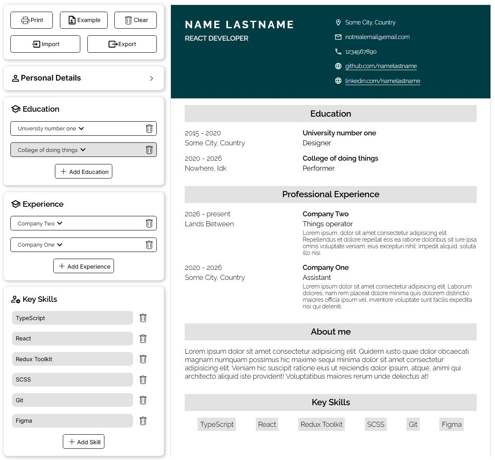

# CV Builder

### **Description**

Minimalistic CV generator made with React and Redux Toolkit that allows users to create professional-looking CV's with ease.

#### 🔗 [Live preview](https://dimar-resume.netlify.app/)



### **Features**

- Set up your resume with personal details, received educations, relevant experience and key skills
- Fill out the forms and the CV will be updated instantly
- Print your finished CV or save it as PDF
- Export your CV and import it to other devices

### **Built With**

- React
- Redux Toolkit
- TypeScript
- SCSS
- Vite

### Installing and running

```bash
git clone https://github.com/Dimar1510/cv-project.git
cd cv-project
npm install
npm run dev
```
